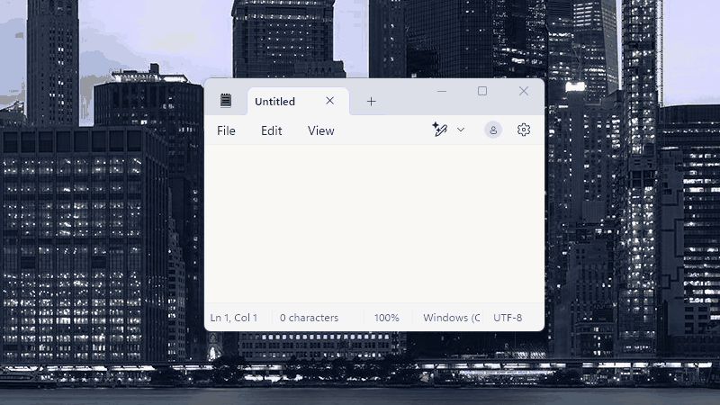

# A Window Movement Suite

A Window Movement Suite is an AutoHotkey v2.0-based collection of scripts that gives you flexible window management at your fingertips. It lets you dynamically resize, move, snap, and even set windows as always-on-top using simple mouse and keyboard combinations.

---

## Features

- **Width Scaling**  
  Toggle width scaling with *Left Ctrl + Right Mouse Button*. Adjust window width on the fly.

- **Height Scaling**  
  Toggle height scaling with *Left Shift + Right Mouse Button*. Adjust window height interactively.

- **XY (Proportional) Scaling**  
  Enable proportional scaling with *Left Ctrl + Left Shift + Right Mouse Button*. A preview GUI lets you see the changes before applying them.

- **Window Movement with Snapping**  
  Move windows using *Left Alt + Right Mouse Button*. The module supports:
  - Edge snapping *s* to other open windows.
  - Screen (monitor) edge snapping.
  - A settings GUI to customize the "snap distance."
  - Built-in safety checks to re-enable normal behavior if keys are released.

  

- **Window Positioning Grid**
  Press the `Z` key while moving to bring up a grid-based positioning menu. Snap windows to common layouts (e.g., left/right halves, thirds, or quarters) using on-screen buttons.

- **Window Grouping**
  Group two windows together to move them as a unit using *Left Alt + Left Win + Left Mouse Button*. Features include:
  - Click two windows to create a group (blue highlight appears)
  - Move grouped windows together with *Left Alt + Right Mouse Button*
  - Reposition individual windows within a group with *Left Alt + Left Win + Right Mouse Button*
  - Maintains z-order (stacking) using always-on-top
  - Click a grouped window again to ungroup

- **Always-on-Top Toggle**
  Use *Left Control + Middle Mouse Button* to quickly toggle the always-on-top state of a window, with visual notifications confirming the change.

- **Modular Design**  
  The suite is split into several include files:
  - **WindowScaleColors.ahk2** – Contains color and minimum dimension definitions.
  - **WindowScaleWidth.ahk2** and **WindowScaleHeight.ahk2** – Manage directional scaling.
  - **WindowScaleProportional.ahk2** and **WindowScaleXY.ahk2** – Provide proportional scaling with a preview.
  - **WindowMove.ahk2** – Handles window moving, snapping, and positioning.
  - **WindowAlwaysOnTop.ahk2** – Implements the always-on-top functionality.

---

## Getting Started

1. **Install AutoHotkey v2.0**  
   Download and install AutoHotkey version 2.0 from the [official website](https://www.autohotkey.com/).

2. **Clone/Download the Repository**  
   Clone or download the A Window Movement Suite repository into your local machine.

3. **Run the Main Script**  
   Launch the main script (e.g., `AWindowMovementSuite.ahk2`). A system tray icon will appear—this is your central hub for toggling features.

---

## Usage

- **Tray Menu Options:**
  Right-click the tray icon to toggle individual features:
  - *Width Scaling (LCtrl+RButton)*
  - *Height Scaling (LShift+RButton)*
  - *XY Scaling (LCtrl+LShift+RButton)*
  - *Always on Top (LCtrl+MButton)*
  - *Window Move (LAlt+RButton)*
  - *Window Cascade (RAlt+Up)*
  - *Window Grouping (LAlt+LWin+LButton)*
  - Open settings for window move (to adjust snap distance).

- **Resizing Windows:**
  - To scale, hold the appropriate modifier keys while right-clicking (using the corresponding combination for width, height, or proportional scaling).
  - A preview window appears (if proportional scaling is enabled) to show you the new size and position before the change is applied.

- **Moving Windows:**
  - Hold *Left Alt* and the right mouse button.
  - If you hold the `S` key during movement, snapping (to either screen or window edges) will be enabled.
  - Press the `Z` key during movement to bring up an on-screen grid for quick positioning.

- **Grouping Windows:**
  - Hold *Left Alt + Left Win* and left-click the first window (blue highlight appears).
  - Continue holding and left-click the second window to create a group.
  - Once grouped, use *Left Alt + Right Mouse Button* on either window to move both together.
  - Use *Left Alt + Left Win + Right Mouse Button* to reposition a single window within the group.
  - Click a grouped window with *Left Alt + Left Win + Left Mouse Button* to ungroup.

- **Always-on-Top:**
  - Hover over a window and press *Left Control + Middle Mouse Button* to toggle its topmost state.
  - The script validates whether the window is eligible (for example, system windows are excluded).

---

## Known Issues

- **XY Scaling on Multiple Monitors**: The XY scaling functionality does not work correctly on multiple monitor setups. This is a known issue being investigated.

For more issues or to report new ones, please visit the [Issues page](https://github.com/yourusername/AWindowMovementSuite/issues).

---

## Customization

- **Snap Distance:**  
  Adjust the snap distance (in pixels) via the *Window Move Settings* tray option.

- **Modifier Keys:**  
  The default hotkeys use common modifiers (Ctrl, Shift, Alt). Feel free to change these assignments in the code if needed.

- **Excluded Windows:**  
  The scripts include helper functions (e.g., `IsValidWindowForResize` and `IsValidWindowForMove`) to ignore specific window types. Modify the excluded classes or styles to better suit your environment.

- **Visual Appearance:**  
  The preview GUI uses color constants defined in the `WindowScaleColors.ahk2` include. Update these values to customize the look and feel.

---

## Contributing

Contributions, issues, and feature requests are welcome!  
Feel free to fork the repository and submit pull requests.

---

## License

Distributed under the MIT License. See `LICENSE` for more information.

---

Happy scaling and window managing! Enjoy the power of precise (and fun) window control on your Windows system.